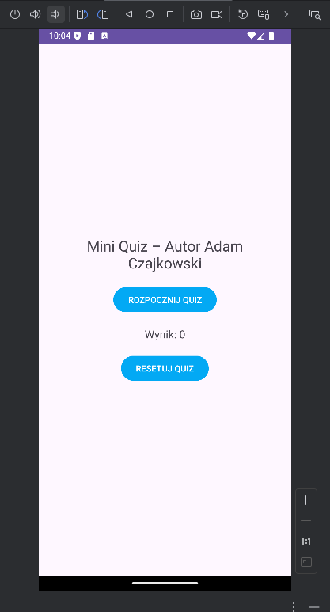
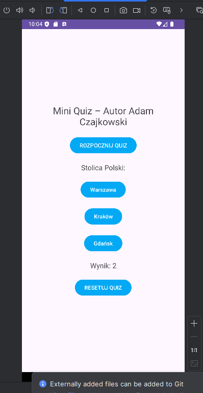
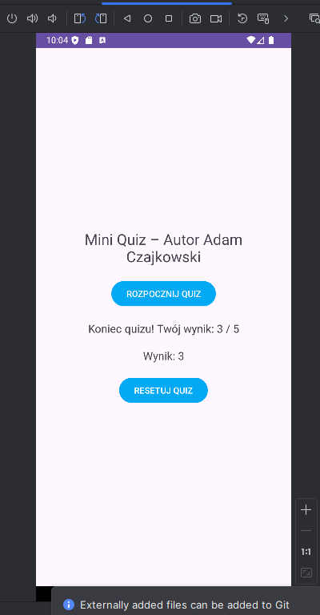

# Mini Quiz - Aplikacja Edukacyjna

Mobilna aplikacja edukacyjna stworzona w środowisku **Android Studio**, która pozwala użytkownikowi sprawdzić swoją wiedzę w prostym teście wielokrotnego wyboru. Projekt został wykonany zgodnie ze specyfikacją zadania rekrutacyjnego/egzaminacyjnego.

## 📝 Opis projektu
Aplikacja "Mini Quiz" umożliwia:
* Rozpoczęcie quizu składającego się z 5 losowo wybranych pytań.
* Wybór jednej z trzech odpowiedzi (A, B lub C).
* Bieżące śledzenie wyniku punktowego.
* Wyświetlenie podsumowania po zakończeniu serii pytań.
* Zresetowanie wyników i ponowne podejście do quizu.

## 🚀 Instrukcja uruchomienia

Aby uruchomić aplikację na swoim komputerze, wykonaj poniższe kroki:

### Wymagania wstępne
* Zainstalowane **Android Studio** (zalecana wersja Ladybug lub nowsza).
* Zainstalowane SDK Androida (poziom API 30 lub wyższy).
* Skonfigurowany emulator Androida lub fizyczne urządzenie podłączone przez USB.

## 🚀 Instrukcja uruchomienia
Pobierz projekt: Sklonuj repozytorium (git clone [url]) lub pobierz i wypakuj plik ZIP.

Otwórz w Android Studio: Wybierz File > Open i wskaż folder projektu.

Zsynchronizuj Gradle: Poczekaj, aż pasek postępu na dole ekranu zniknie (Gradle Sync).

Włącz emulator: Uruchom Device Manager i włącz dowolne urządzenie wirtualne (lub podepnij telefon).

Uruchom aplikację: Kliknij zielony przycisk Run (ikona trójkąta) lub użyj skrótu Shift + F10.

🛠️ Struktura plików (weryfikacja)
Logika: app/src/main/java/com/example/miniquiz/MainActivity.java

Model: app/src/main/java/com/example/miniquiz/Question.java

Interfejs: app/src/main/res/layout/activity_main.xml

## 🛠️ Technologie i struktura
* **Język programowania:** Java
* **Interfejs użytkownika:** XML (LinearLayout)
* **Struktura plików:**
    * `MainActivity.java`: Główna logika aplikacji (obsługa kliknięć, licznik punktów).
    * `Question.java`: Model danych reprezentujący pojedyncze pytanie.
    * `activity_main.xml`: Definicja układu UI.

## 📸 Zrzuty ekranu

---
**Autor:** Adam Czajkowski
